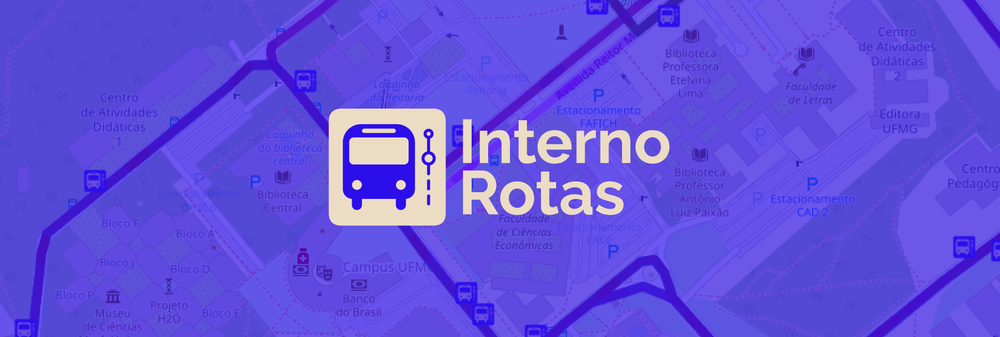
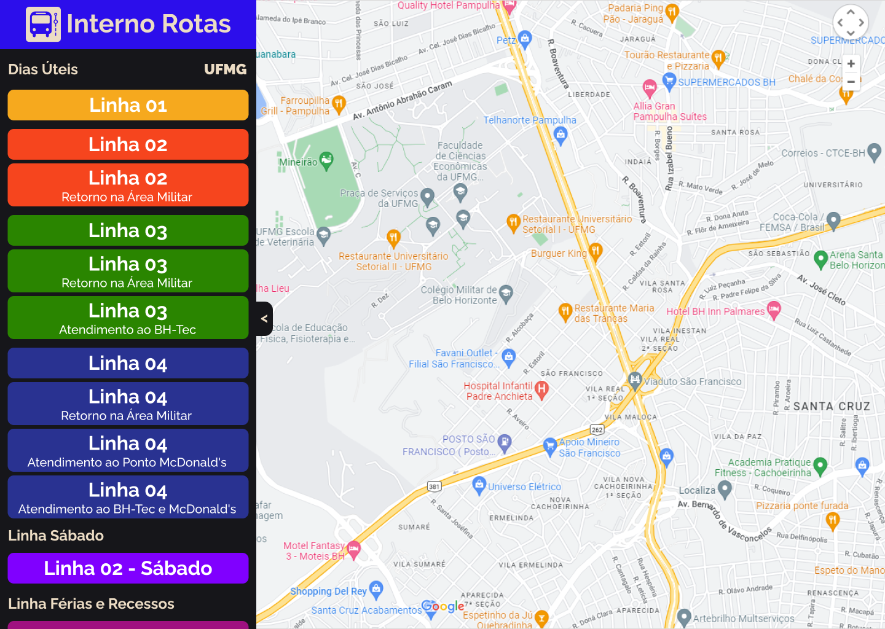
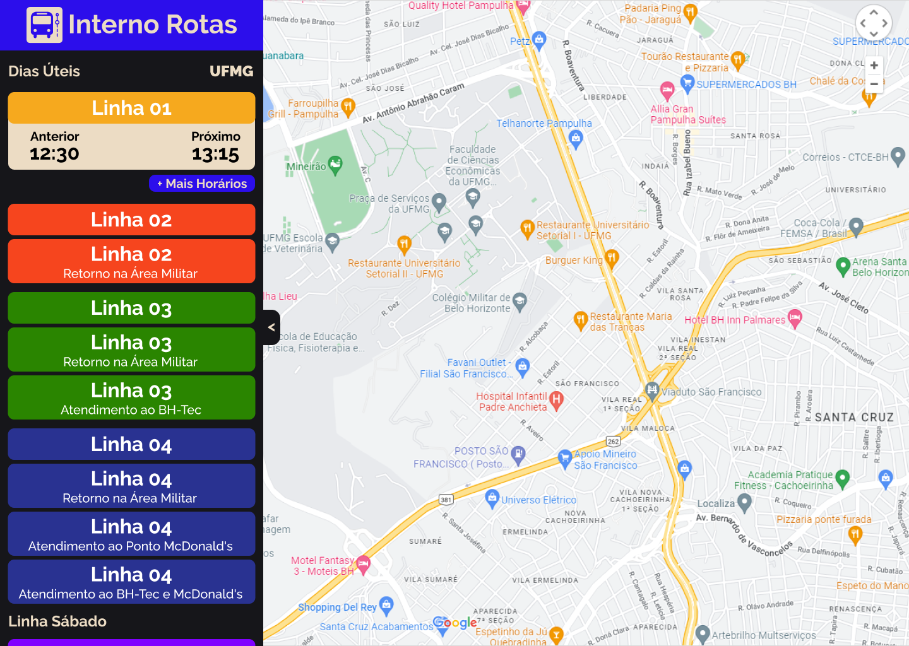
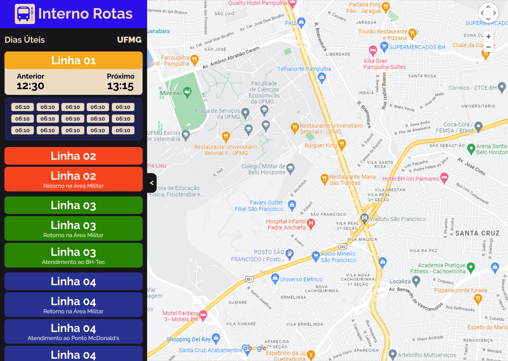
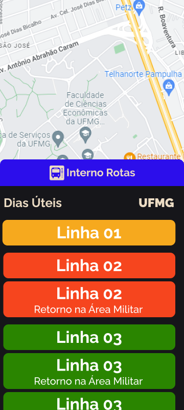
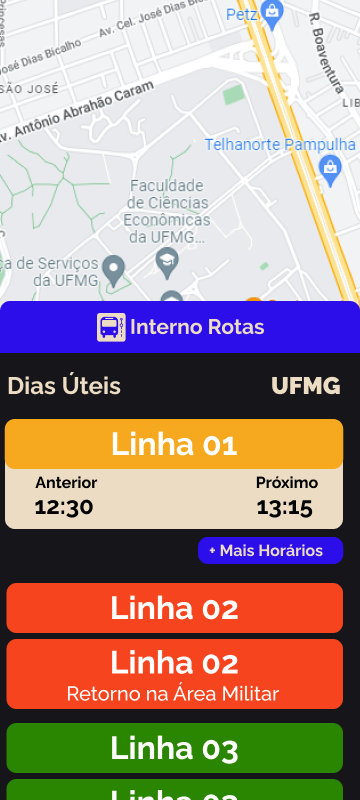
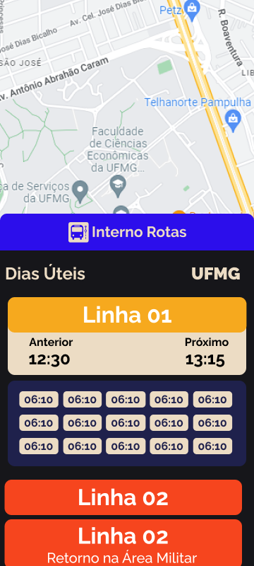

# Interno Rotas - UFMG 🚌

<h1 align="center">
  
</h1>

  
    
  
  
  
  

## Sumário

- <a href="#sobre-o-projeto">Sobre o Projeto</a>
- <a href="#tecnologias">Tecnologias</a>
- <a href="#acessar-o-projeto">Acessar o projeto</a>
- <a href="#layout">Layout</a>
- <a href="#requisitos">Requisitos</a>
- <a href="#funcionalidades-extras">Funcionalidades Extras</a>
- <a href="#licença">Licença</a>

## Sobre o Projeto

O Interno Rotas é um site que vem para facilitar a locomoção de pessoas dentro do Campus Pampulha da UFMG, sejam elas parte da comunidade acadêmica ou não. O projeto surgiu a partir de uma necessidade que eu mesmo tinha quando precisava usar os ônibus internos da UFMG. No site disponibilizado pela universidade consta as rotas, horários e locais que os ônibus passam, porém a informação muitas vezes não é intuitiva. Para pessoas pouco familiarizadas com o ambiente da UFMG fica muito difícil se orientar pelo site, já que são mostradas apenas as siglas de onde o interno passa próximo.

Por conta disso, achei que seria interessante criar um site que pudesse ser útil tanto para os colegas da comunidade acadêmica como também para o público externo que precise, em algum momento, usar os ônibus internos.

Caso tenha gostado do projeto e encontrado pontos de melhorias, fique a vontade para ajudar!

## Tecnologias

Para tornar real o projeto foram utilizadas as seguintes tecnologias:

- HTML
- CSS
- JavaScript
- OpenStreetMap (API de mapas)
- Leaflet (biblioteca javascript de mapeamento)
- Leaflet Ant Path (animação da polyline)

## Acessar o projeto

O projeto pode ser acessado através [deste site](https://internorotas.github.io/ufmg/), hospedado no GitHub Pages.

## Layout

Seção com o layout do projeto. O layout serve para auxiliar no desenvolvimento do código, servindo como guia e economizando tempo. O layout serve apenas para se ter uma ideia e referência, não sendo necessário que seja perfeito. O design do projeto pode ser visto com mais detalhes aqui no [Figma](https://www.figma.com/file/eTM6soQcsMP2vZr4d2zGus/Interno-Rotas?node-id=0%3A1&t=np3vESaYKP8h6Bn1-1).

A medida que fui desenvolvendo o código do projeto fui notando a necessidade de fazer algumas adaptações, portanto o design final está ligeiramente diferente do mostrado aqui. Por enquanto irei deixar o layout antigo aqui apenas por curiosidade, para ver quais mudanças foram feitas.

### Tela Inicial - Desktop

Tela inicial em que o usuário consegue ver o mapa ao fundo, com as linhas internas em uma painel lateral. Cada linha tem sua cor única, para facilitar sua identificação. Na tela não é possível ver, mas o menu lateral conta com scroll para ver mais linhas e um botão de reportar problemas e outro para exibir informações sobre o projeto.

### Escolher Linha - Desktop

Tela em que o usuário escolhe uma linha específica. Com isso, é exibida o horário anterior e o próximo horário daquele interno. O usuário também pode escolher se deseja ver mais horários daquela linha.

### Exibir Horários - Desktop

Nesta tela são mostrados todos os horários em que aquela linha roda.

### Tela Inicial - Mobile

Pensando no fato de a maioria das pessoas utilizarem o celular, foi feito o layout com as mesmas funções, porém adaptado para as telas de celulares e outros dispositivos com telas pequenas. A responsividade deve ser trabalhada nesse projeto para melhorar a acessibilidade.

### Escolher Linha - Mobile

### Exibir Horários - Mobile

## Requisitos

Requisitos mínimos e importantes levantados até o momento para o desenvolvimento do site.

- Mostrar mapa que tenha nome dos prédios e pontos
- Menu lateral com nome das linhas
- O usuário deve ver um traçado por onde as linhas passam, além de poder dar zoom para ver as informações
- As linhas devem ser separadas com cores, além de representadas as suas subdivisões
- O site deve ser completamente funcional em celulares e aparelhos com telas pequenas

## Funcionalidades Extras

A ideia inicial é terminar primeiro o básico para ter o site funcional, com as demais funções sendo implementadas ao longo do tempo.

- [x] Cada ponto de parada no mapa exibir quais ônibus param naquela parada
- [x] Mostrar horário dos ônibus de cada linha selecionada
- [x] Mostrar horário do ônibus anterior e do próximo ônibus
- [ ] Criar base de comunidade para levar a aplicação para outras universidades que contam com linhas internas mas que não tenham as suas rotas.

## Licença

Este projeto está sob a licença MIT. Veja o arquivo [LICENSE](LICENSE.md) para mais detalhes.

<h3 align="center" >Gostou do projeto e quer entrar em contato?</h3>

    <a href="https://www.linkedin.com/in/igormartins44/">LinkedIn</a> |
    <a href="https://www.instagram.com/titan.css">Instagram</a> |
    <a href="https://www.behance.net/titanstudio44">Behance</a>

 

    Desenvolvido com 💙 por Igor Martins

